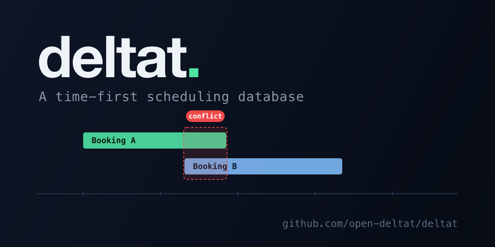

<p align="center">
  
</p>

<p align="center">
  <a href="https://crates.io/crates/deltat"></a>
  <a href="https://crates.io/crates/deltat"></a>
  <a href="https://github.com/open-deltat/deltat/actions/workflows/ci.yml"></a>
  <a href="LICENSE"></a>
  <a href="https://delt.at"></a>
</p>

---

## The idea

In a video game, a collision engine answers one question: do these two objects overlap?

Scheduling is the same problem in one dimension. A booking is a segment range on the number line of unix time. Two bookings conflict when their segments collide. That's the entire model.

```
 ──────[  Flight  ]───────────────────────────────────────
 ────────────[  Dentist  ]────────────────────────────────
 ──────────────────────[  Hotel  ]────────────────────────
```

Everything in scheduling is just an extension of this primitive:

| Concept | What it means |
|---|---|
| **Booking** | A segment placed on the timeline |
| **Conflict** | Two segments that overlap |
| **Capacity** | How many segments can stack on the same point |
| **Buffer** | A forced gap after each segment |
| **Rule** | A region of the line marked open or closed |
| **Hold** | A segment with a self-destruct timer |
| **Availability** | The gaps between everything already placed |

deltat is a database built entirely around this primitive. It operates purely on raw `i64` Unix milliseconds. No time zones, no calendars, no date formats. No pricing, no user profiles, no business data. Just segments on a number line.

Scheduling has historically been painful because it was forced into relational databases that weren't designed for it: time intervals, collision detection, and availability queries bolted onto tables built for storing rows. deltat inverts that. Time isn't a column in someone else's schema. It's the entire database.

Human-readable time is a display concern that belongs in the client. The database just sees numbers on a line, which means it will work unchanged as long as 64-bit integers exist.

## What it is

A single Rust binary that speaks PostgreSQL. No Postgres underneath: it's a purpose-built in-memory engine backed by an append-only WAL. Connect with any Postgres client.

> The PostgreSQL wire protocol is the current transport; a v2 framed protocol (+ HTTP/MCP) is planned (see `docs/REQUIREMENTS.md`).

- Sub-millisecond availability queries
- Hierarchical resources (Flight → Cabin → Seat)
- Capacity, buffers, holds with auto-expiry
- Atomic batch bookings (all-or-nothing)
- Real-time LISTEN/NOTIFY events

Working in TypeScript? [TAP](https://github.com/open-deltat/tap), the Time Allocation Protocol, is the typed SDK (`@open-deltat/client`) over deltat, so you speak in resources, holds, and availability instead of SQL.

## Quick start

```bash
cargo install deltat

DELTAT_PASSWORD=secret deltat
```

Or build from source: `cargo install --git https://github.com/open-deltat/deltat.git`

Connect on port 5433:

```bash
psql -h localhost -p 5433 -U deltat
```

---

## Usage

### Resources

Anything bookable. Resources form a tree: children inherit availability from their parent.

```sql
INSERT INTO resources (id, parent_id, name, capacity, buffer_after)
VALUES ('01J...', NULL, 'Flight AA-100', 1, 2700000);

INSERT INTO resources (id, parent_id, name)
VALUES ('01J...', '01J_FLIGHT...', 'Seat 1A');
```

```sql
SELECT * FROM resources WHERE parent_id IS NULL;       -- roots
SELECT * FROM resources WHERE parent_id = '01J...';    -- children
```

### Rules

When a resource is open or closed.

```sql
-- Available 9am-5pm
INSERT INTO rules (id, resource_id, start, "end", blocking)
VALUES ('01J...', '01J...', 1706000000000, 1706028800000, false);

-- Blocked for maintenance
INSERT INTO rules (id, resource_id, start, "end", blocking)
VALUES ('01J...', '01J...', 1706028800000, 1706032400000, true);
```

### Bookings

Place a segment on the line.

```sql
INSERT INTO bookings (id, resource_id, start, "end", label)
VALUES ('01J...', '01J...', 1706000000000, 1706003600000, 'Team Meeting');

-- Batch: all or nothing
INSERT INTO bookings (id, resource_id, start, "end")
VALUES ('01J_A...', '01J_SEAT1...', 1706000000000, 1706003600000),
       ('01J_B...', '01J_SEAT2...', 1706000000000, 1706003600000);

DELETE FROM bookings WHERE id = '01J...';
```

### Holds

Temporary segments that auto-expire.

```sql
-- Hold for 15 minutes
INSERT INTO holds (id, resource_id, start, "end", expires_at)
VALUES ('01J...', '01J...', 1706000000000, 1706003600000, 1706000900000);

DELETE FROM holds WHERE id = '01J...';
```

### Availability

Find the gaps.

```sql
SELECT * FROM availability
WHERE resource_id = '01J...'
  AND start >= 1706000000000
  AND "end" <= 1706086400000;

-- Minimum 1-hour slots
SELECT * FROM availability
WHERE resource_id = '01J...'
  AND start >= 1706000000000
  AND "end" <= 1706086400000
  AND min_duration = 3600000;

-- Multi-resource: when are all 3 free?
SELECT * FROM availability
WHERE resource_id IN ('01J_A...', '01J_B...', '01J_C...')
  AND start >= 1706000000000
  AND "end" <= 1706086400000;

-- When are at least 2 of 3 free?
SELECT * FROM availability
WHERE resource_id IN ('01J_A...', '01J_B...', '01J_C...')
  AND start >= 1706000000000
  AND "end" <= 1706086400000
  AND min_available = 2;
```

### Events

Real-time notifications via LISTEN/NOTIFY.

```sql
LISTEN resource_01J...;
UNLISTEN resource_01J...;
```

---

## Reference

All times are **Unix milliseconds**. Intervals are half-open `[start, end)`, so adjacent segments don't collide.

### Configuration

| Env var | Default | Description |
|---|---|---|
| `DELTAT_PORT` | `5433` | Listen port |
| `DELTAT_BIND` | `0.0.0.0` | Bind address |
| `DELTAT_DATA_DIR` | `./data` | WAL storage directory |
| `DELTAT_PASSWORD` | `deltat` | Connection password |
| `DELTAT_MAX_CONNECTIONS` | `256` | Concurrent connection cap |
| `DELTAT_COMPACT_THRESHOLD` | `1000` | WAL appends before a compaction runs |
| `DELTAT_GC_RETENTION_MS` | `604800000` | Age (7 days) past which finished bookings and expired holds are collected |
| `DELTAT_METRICS_PORT` | unset | Prometheus `/metrics` port; metrics are off when unset |
| `DELTAT_TLS_CERT` | unset | PEM certificate path; TLS is off unless both cert and key are set |
| `DELTAT_TLS_KEY` | unset | PEM private key path; TLS is off unless both cert and key are set |

### Architecture

```
src/
  engine/          Availability computation, conflict detection, state mutations, queries
  model.rs         Core types: Span, Interval, ResourceState, Event
  command.rs       Transport-neutral command vocabulary (the v2 protocol target)
  sql.rs           SQL parser, producing commands
  wire.rs          pgwire protocol (simple + extended query)
  wal.rs           Append-only write-ahead log with group commit
  tenant.rs        Per-tenant engine + WAL, lazily created
  notify.rs        LISTEN/NOTIFY broadcast
  reaper.rs        Background hold expiration, WAL compaction, interval GC
  clock.rs         Injected clock seam (deterministic in tests)
  auth.rs          Cleartext password authentication
  tls.rs           Optional rustls TLS
  observability.rs Prometheus metrics (opt-in)
  limits.rs        Hard caps (resources, intervals, query windows)
  main.rs          TCP listener and configuration
```

### Client libraries

**TypeScript**: [@open-deltat/client](https://github.com/open-deltat/tap)

### Demos

The [tap](https://github.com/open-deltat/tap) repo includes a Next.js demo app with interactive examples spanning seat maps (airline, theater, stadium), multi-resource availability, recurring schedules, capacity pools, and hold-to-book flows.

## License

[AGPL-3.0](LICENSE)
